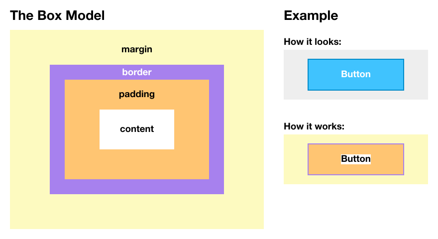

# Chapter 1: Introduction

## How the web works

## Text editor
Get the Atom text editor here: http://atom.io

## HTML (Content Structure)

Basic structure of a tag: `<tag attribute="value"> content </tag>`

### Page structure

```
<!DOCTYPE html>
<html>
  <head>
    meta information about the page
  </head>
  <body>
    actual page content
  </body>
</html>
```

### Content Tags
Tags used in the `<body>` to describe the visible element of the page.

* Paragraph `<p> text </p>`
* Header
  ```
  <h1> main header </h1>
  <h2> second-level header </h2>
  ...
  <h6> sixth-level header </h6>

  ```
* Unordered list
  ```
  <ul>
    <li> list item </li>
    <li> list item </li>
  </ul>
  ```
* Ordered list
  ```
  <ol>
    <li> list item </li>
    <li> list item </li>
  </ol>
  ```
* Image ``

#### Comments
To make HTML code disappaear from the page, you can just add `<!--` and `-->` before and after it.
example:
```
<!--
  <p> This won't be on the page </p>
-->
<p> This will! </p>
```


### Meta Tags
Tags used in the `<header>` containing information about the page.

* Title tag `<title> My Site's Title </title>`
* Link tag (for including external files; example: external style sheet) `<link rel="stylesheet" href="style.css">`
* Meta tag (general information; example: Meta tag that enables special characters on the page)  `<meta charset="UTF-8">`


## CSS (Styles)

Basic structure of a stylesheet:

```
selector {
  property: value;
  property: value;
  property: value;
}
```

example:
```
h1 {
  font-size: 40px;
}

.button {
  padding: 1em;
  color: white;
  background-color: red;
}
```

### Basic visual style

property | explanation | example
---------|-------------|--------
color | Color of the text | `color: blue`
background-color | Color of the background behind the text | `background-color: #00f145`
font-family | Name of the font. Usually defined as a comma separated list of fonts. If the first font is not installed, it will use the second and so on. | `font-family: "Minion, Georgia, serif"`
font-size | Type size | `font-size: 18px`
font-weight | Weight of the current font. Can be expressed as both a numeric value (e.g. 300, 400, 600) or a name (e.g. "bold", "regular") | `font-weight: 200`
font-style | Normal/Italic/Oblique | `font-style: italic`
text-align | Text alignment (left, right, center or justify) | `text-align: center`
text-decoration | Underline/strikethrough style | `text-decoration: underline`
opacity | Opacity of the element (0 = invisible, 1 = fully visible) | `opacity: 0.7`

### Box Model

property | explanation | example
---------|-------------|--------
width, height | Width and height of the element. By default, they only affect the content and **do not include padding or border**.  | `width: 100px`
padding | The space between the text or content inside an element and its border. Can be defined separately for each side, or all at once using the shorthand property `padding: top right bottom left` | `padding: 10px 5px 3px 7px` equivalent to `padding-top: 10px` `padding-right: 5px` `padding-bottom: 3px` `padding-left: 7px`
margin | The space between the border of the element and the next adjacent element. Same syntax as padding. | `margin: 10px 20px 5px 15px`
border | Style of the element's border | `border: 2px solid green`



**Note:** To simplify working with the box model, include the following code at the beginning of your CSS. It makes the width and height properties work independently of padding and border.

```
* {
  -webkit-box-sizing: border-box;
  box-sizing: border-box;
}
```

### Units

unit | explanation | example
-----|-------------|--------
**px** | Pixels on the screen | `padding: 10px`
**%** | Usually the percentage of the width of the parent element (Depends on property) | `width: 50%`
**em** | x times the parent element's font size in pixels | `font-size: 1.5em` (equivalent to  `font-size: 24px` if the parent's font size is 16px)
**rem** | x times the root (`<html>`) element's font size in pixels | `margin: 2rem` (equivalent to  `margin: 32px` if the root's font size is 16px)

### Color formats

format | example | explanation
-------|---------|------------
built-in colors | `red` | Browsers have a few basic colors built in, you can simply use them by name (e.g. red, green, blue, black, white ...)
Hexadecimal | `#ff00ba`  | Describes the RGB value as 3 consecutive hexadecimal numbers (#rrggbb). In this case `ff` is the red value, `00` green, and `ba` blue.
RGB | `rgb(34, 12, 64)` | A different way of writing RGB colors, with decimal numbers (0...255) for red, green and blue instead of hex numbers.
RGBA | `rgba(34, 12, 64, 0.3)` | Exactly the same as the previous, but additionally, the opacity of the color (0...1) can be defined with the last parameter.
